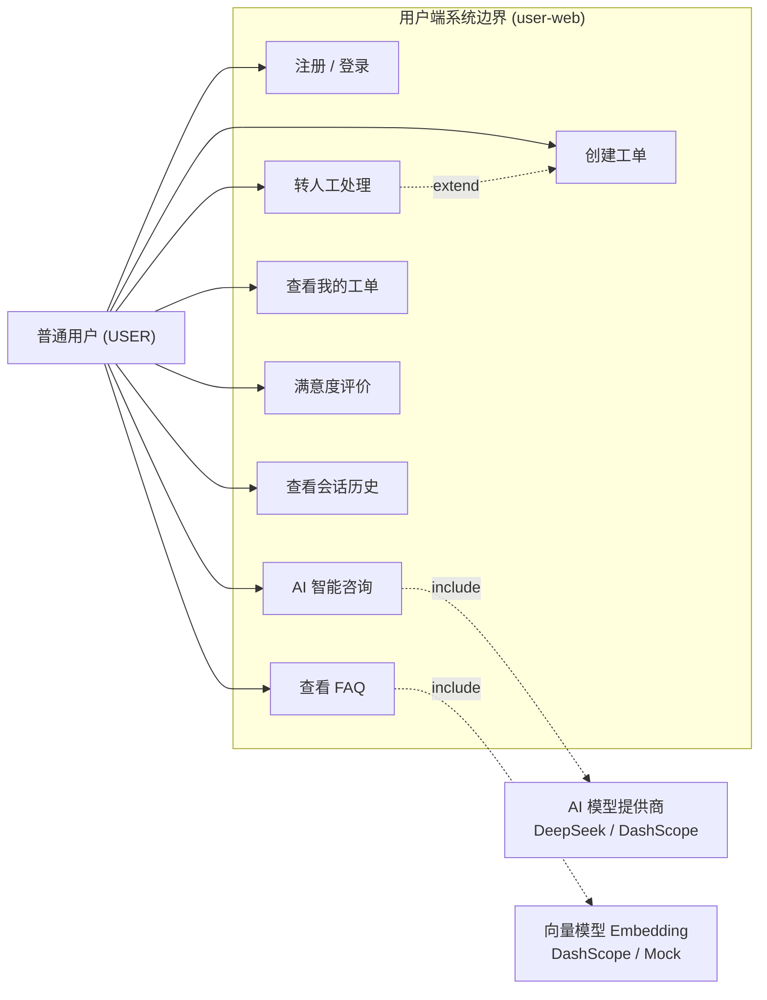
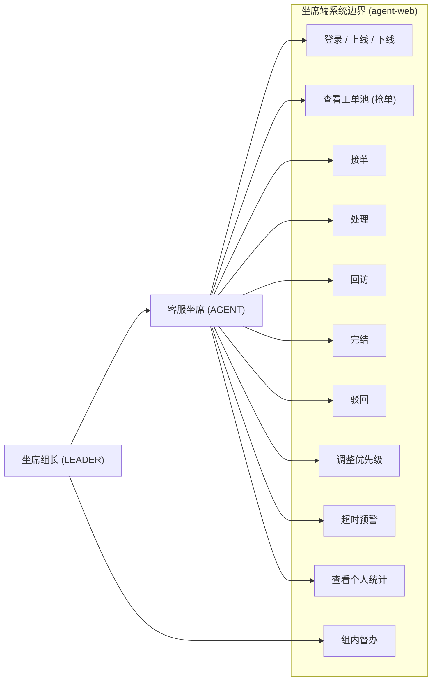
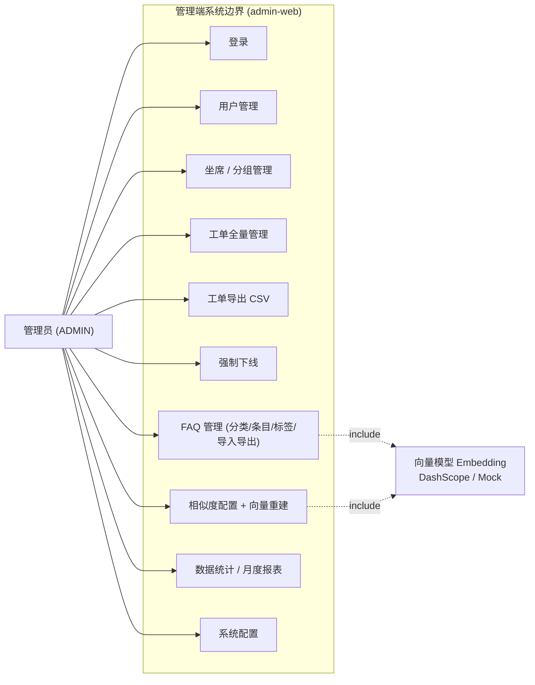

# AI 智能客服工单处理系统 — 工程设计文档

> 版本: 0.2.0 | 日期: 2026-08-12 | 分支: feat-xwj
> 同步记录：Spring Boot 3.4.5 升级、手写 AI → Spring AI 1.0.0、新增 DashScope provider、admin 角色 403 修复、Docker 构建优化（详见 [ref/refactor/01-ai.md](refactor/01-ai.md)）

---

## 目录

1. [系统概述](#1-系统概述)
2. [系统架构](#2-系统架构)
3. [模块设计](#3-模块设计)
4. [数据库设计](#4-数据库设计)
5. [API 接口设计](#5-api-接口设计)
6. [AI 与 RAG 设计](#6-ai-与-rag-设计)
7. [前端设计](#7-前端设计)
8. [安全设计](#8-安全设计)
9. [部署方案](#9-部署方案)

---

## 1. 系统概述

### 1.1 项目定位

AI 智能客服工单处理系统是一套面向线下商户、高校后勤、互联网中小企业的**一体化咨询报修工单平台**，融合 FAQ 知识库、RAG 智能问答、工单全流程流转、多角色坐席管理、数据统计分析五大核心能力。

### 1.2 核心角色

```
┌──────────────────────────────────────────────────────┐
│                    系统角色模型                        │
├──────────┬───────────────────┬────────────────────────┤
│ 普通用户  │ 客服坐席 (AGENT)   │ 管理员 (ADMIN)          │
│ (USER)   │                   │                        │
├──────────┼───────────────────┼────────────────────────┤
│· 浏览FAQ  │· 接单/处理工单     │· 用户/坐席/管理员管理    │
│· AI 咨询  │· 工单回访          │· 工单全量管理           │
│· 创建工单 │· 查看工单池        │· 坐席分组管理           │
│· 满意度评价│· 坐席组长督办     │· FAQ 知识库管理          │
│· 历史会话 │· 查看个人统计      │· 数据统计看板           │
│          │· 在线/离线切换     │· 系统配置               │
└──────────┴───────────────────┴────────────────────────┘
```

### 1.3 三位一体端口架构

系统分为三个独立交互端口，对应三类角色：

| 端口 | 项目 | 默认端口 | 用户角色 | 核心场景 |
|------|------|----------|----------|----------|
| 用户端 | ai-ticket-user-web | 3003 | 普通用户 | AI 咨询、创建工单、查看 FAQ、满意度评价 |
| 坐席端 | ai-ticket-agent-web | 3002 | 客服坐席 | 工单处理、工单池抢单、超时预警、统计看板 |
| 管理端 | ai-ticket-admin-web | 3001 | 系统管理员 | 全局管理、FAQ 维护、数据报表、系统配置 |

### 1.4 用例图（Use Case）

三个端口对应三类参与者，用例按角色边界划分（Mermaid flowchart）。表示法：参与者节点 → 系统边界（subgraph）内的用例节点；虚线箭头标注 `include`（必然包含）/ `extend`（可选扩展），实线箭头表示关联或角色泛化。

#### 用户端用例（user-web）



#### 坐席端用例（agent-web）



#### 管理端用例（admin-web）



#### 跨端口用例关系说明

| 关系 | 说明 |
|------|------|
| `AI 智能咨询` <<include>> `AI 模型提供商` | 对话未命中 FAQ 时必然调用大模型（DeepSeek/DashScope/Mock）生成回答 |
| `转人工` <<extend>> `创建工单` | 转人工在 AI 会话基础上复用工单创建流程（`source=AI_CHAT`），无需用户重复填写 |
| `FAQ 语义匹配` <<include>> `向量模型` | 用户端 FAQ 浏览 / 对话，以及管理端"匹配测试"都依赖 Embedding 向量余弦比对 |
| `相似度配置 + 向量重建` <<include>> `向量模型` | 管理端重建向量时调用 Embedding，并自动处理维度切换（mock 64 维 ↔ DashScope 高维） |
| 坐席组长 `泛化` 客服坐席 | 组长继承坐席全部用例，另可督办本组工单（`agent_group.leader_agent_id`） |

---

## 2. 系统架构

### 2.1 整体架构

```
┌───────────────────────────────────────────────────────────────────┐
│                        前端展示层 (Presentation)                    │
│  ┌──────────────────┐ ┌──────────────────┐ ┌──────────────────┐   │
│  │   user-web       │ │   agent-web      │ │   admin-web      │   │
│  │   Vue3 + Element  │ │   Vue3 + Element  │ │   Vue3 + Element  │   │
│  │   Port: 3003      │ │   Port: 3002      │ │   Port: 3001      │   │
│  └────────┬─────────┘ └────────┬─────────┘ └────────┬─────────┘   │
│           │                    │                    │              │
│           └────────────────────┼────────────────────┘              │
│                                │ /api/*                            │
├────────────────────────────────┼────────────────────────────────────┤
│                    网关层 (Gateway — Nginx)                         │
│                反向代理 + 静态资源分发 + SSE 透传                     │
├────────────────────────────────┼────────────────────────────────────┤
│                    应用层 (Application)                             │
│  ┌─────────────────────────────────────────────────────────────┐   │
│  │               Spring Boot 3.4.5 (Port: 8080)                │   │
│  │  ┌─────────┐ ┌──────────┐ ┌──────────┐ ┌───────────────┐   │   │
│  │  │  Auth   │ │  Ticket  │ │   Chat   │ │   Statistics  │   │   │
│  │  │ Module  │ │  Module  │ │  Module  │ │    Module     │   │   │
│  │  └─────────┘ └──────────┘ └──────────┘ └───────────────┘   │   │
│  │  ┌─────────┐ ┌──────────┐ ┌──────────────────────────────┐  │   │
│  │  │  Admin  │ │   FAQ    │ │  AI Provider (Spring AI 1.0)  │  │   │
│  │  │ Module  │ │  Module  │ │  ChatModel + EmbeddingModel   │  │   │
│  │  └─────────┘ └──────────┘ └──────────────────────────────┘  │   │
│  └─────────────────────────────────────────────────────────────┘   │
├─────────────────────────────────────────────────────────────────────┤
│                      数据层 (Data)                                   │
│  ┌──────────────┐  ┌──────────────────┐  ┌──────────────────┐      │
│  │   MySQL 8.0  │  │   MyBatis-Plus   │  │   Sa-Token       │      │
│  │  (持久存储)   │  │   (ORM 映射)     │  │   (会话管理)      │      │
│  └──────────────┘  └──────────────────┘  └──────────────────┘      │
├─────────────────────────────────────────────────────────────────────┤
│                     外部服务 (External)                               │
│  ┌──────────────────────────────────────────────────────────────┐   │
│  │  DeepSeek API (OpenAI 兼容) / DashScope API (阿里云百炼)      │   │
│  │  经 Spring AI 统一抽象：ChatModel + EmbeddingModel            │   │
│  └──────────────────────────────────────────────────────────────┘   │
└───────────────────────────────────────────────────────────────────┘
```

### 2.2 技术选型理由

| 组件 | 选型 | 理由 |
|------|------|------|
| 前端框架 | Vue 3 + Composition API | 响应式数据流、TypeScript 类型安全、生态成熟 |
| UI 库 | Element Plus | 企业级中后台组件，中文文档完善 |
| 状态管理 | Pinia | Vue 3 官方推荐，类型推断优于 Vuex |
| 后端框架 | Spring Boot 3 | Java 生态标准，自动配置、监控端点 |
| ORM | MyBatis-Plus | 简化单表 CRUD，QueryWrapper 灵活查询 |
| 权限 | Sa-Token | 轻量级、支持多账号体系、注解鉴权 |
| AI 集成 | Spring AI 1.0.0 | 官方统一抽象（`ChatModel`/`EmbeddingModel`），provider 可插拔 |
| AI Provider | spring-ai-alibaba-core 1.0.0.2 | DashScope（阿里云百炼）官方支持，core 模块无自动配置 |
| 向量相似度 | 自研 VectorUtils | 轻量级余弦相似度计算（支持 float[] 与 List\<Double\>），无外部依赖 |
| 流式响应 | Spring SseEmitter | 标准 SSE 协议，浏览器原生支持 |
| 容器化 | Docker Compose | 一键部署，环境一致性 |

### 2.3 项目包结构

```
com.aics.ticket
├── AiTicketServerApplication.java    # Spring Boot 启动入口
├── admin/                             # 管理员模块
│   ├── AdminController.java          # 管理员 CRUD + 管理仪表板
│   ├── SysAdmin.java                 # 管理员实体
│   └── mapper/SysAdminMapper.java
├── agent/                             # 坐席模块
│   ├── AgentController.java          # 坐席在线/离线 + 管理接口
│   ├── SysAgent.java                 # 坐席实体
│   ├── AgentGroup.java               # 坐席分组实体
│   └── mapper/
├── auth/                              # 鉴权模块
│   ├── AuthController.java           # 三端统一登录/登出
│   ├── AuthService.java              # 登录逻辑 + Sa-Token 会话
│   ├── LoginRequest.java             # 登录请求 DTO
│   ├── LoginResponse.java            # 登录响应 DTO
│   ├── CurrentIdentity.java          # 当前身份工具类
│   └── SaTokenRoleProvider.java      # Sa-Token 角色来源 (StpInterface)
├── chat/                              # AI 对话模块
│   ├── ChatController.java           # 对话 CRUD + 流式消息
│   ├── ChatService.java              # 对话业务逻辑
│   ├── ChatConversationEntity.java   # 会话实体
│   ├── ChatMessageEntity.java        # 消息实体
│   ├── ChatMessageRequest.java       # 消息请求 DTO
│   ├── ViolationGuardService.java    # 违规内容拦截
│   └── mapper/
├── kb/                                # FAQ 知识库模块 (Knowledge Base)
│   ├── FaqController.java            # FAQ 用户端 + 管理端 API
│   ├── FaqService.java               # FAQ 业务逻辑 + RAG 匹配
│   ├── FaqCategory.java              # FAQ 分类实体
│   ├── FaqEntry.java                 # FAQ 条目实体（含向量）
│   └── mapper/
├── ticket/                            # 工单模块
│   ├── TicketController.java         # 用户/坐席/管理员工单 API
│   ├── TicketService.java            # 工单核心业务逻辑
│   ├── TicketEntity.java             # 工单实体
│   ├── TicketEventEntity.java        # 工单事件/流转记录
│   ├── TicketCreateRequest.java      # 创建工单请求 DTO
│   ├── TicketActionRequest.java      # 工单操作请求 DTO
│   ├── TicketRecord.java             # 工单列表展示 DTO
│   ├── TicketEventRecord.java        # 事件记录 DTO
│   └── mapper/
├── statistics/                        # 统计模块
│   ├── StatisticsController.java     # 统计查询 + 满意度提交
│   ├── SatisfactionEntity.java       # 满意度实体
│   └── mapper/SatisfactionMapper.java
├── user/                              # 用户模块
│   ├── SysUser.java                  # 用户实体
│   └── mapper/SysUserMapper.java
├── ai/                                # AI 模型（Spring AI 实现）
│   ├── MockChatModel.java            # 兜底对话模型 (implements ChatModel)
│   └── MockEmbeddingModel.java       # 兜底向量模型 (implements EmbeddingModel)
├── config/                            # 配置
│   ├── AiConfig.java                 # AI 客户端 Bean 配置
│   ├── CorsConfig.java               # CORS + 异步超时配置
│   └── MyBatisPlusConfig.java        # MyBatis-Plus 分页插件
├── common/                            # 公共组件
│   ├── ApiResponse.java              # 统一响应体 {code, message, data}
│   ├── PageResponse.java             # 分页响应体 {records, total, page, size}
│   ├── BusinessException.java        # 业务异常
│   ├── GlobalExceptionHandler.java   # 全局异常处理
│   ├── HealthController.java         # 健康检查端点
│   ├── VectorUtils.java              # 余弦相似度 + 向量 JSON 序列化
│   └── enums/                        # 枚举值定义
└── resources/
    ├── application.yml                # 主配置
    ├── application-dev.yml            # 开发配置 (H2)
    ├── application-local.yml          # 本地配置 (H2)
    └── sql/
        ├── schema.sql / schema-h2.sql # 数据库 DDL
        └── seed.sql / seed-h2.sql     # 种子数据
```

---

## 3. 模块设计

### 3.1 账号鉴权模块 (Auth)

**职责**: 三端登录/登出、多身份识别、会话管理

**核心实现**:
- `AuthController` 提供 3 个登录入口 + 1 个通用登出入口
- `AuthService.login()` 按 `IdentityType` 枚举分发到对应 mapper 验证
- Sa-Token 的 `StpUtil.login()` 使用 `{PREFIX}:{id}` 格式管理会话 Token
- `CurrentIdentity.currentIdOrDefault()` 从 Sa-Token 会话提取数字 ID

**登录流程**:
```
POST /{role}/auth/login {username, password}
  → AuthService.login(request, IdentityType.XXX)
    → 查询对应表 (sys_user/sys_agent/sys_admin)
    → 密码验证 (明文 或 {noop} 前缀)
    → StpUtil.login("{PREFIX}:{id}")
  ← LoginResponse {token, username, identity}
```

**安全薄弱点**:
- 缺少 `@SaCheckLogin` 全局注解保护 → 接口形式上开放
- 密码未使用 BCrypt 哈希 → `{noop}` 明文存储
- 无登录失败次数限制 → 存在暴力破解风险

### 3.2 工单流程引擎模块 (Ticket)

**职责**: 工单全生命周期管理（创建→分配→接单→处理→回访→完结→归档）

**状态机设计**:
```
CREATED ──(auto-assign)──→ ASSIGNED ──(accept)──→ ACCEPTED
                                                      │
                                              (process)│
                                                      ↓
                                                  PROCESSING
                                                      │
                                        ┌─────────────┼─────────────┐
                                   (follow)       (complete)    (reject)
                                        │             │             │
                                        ↓             ↓             ↓
                                    FOLLOWING     COMPLETED     REJECTED
                                        │
                                   (complete)
                                        │
                                        ↓
                                    COMPLETED ──→ SATISFACTION ──→ ARCHIVED
```

**核心流程**:

1. **创建分配**: `TicketService.createForUser()` 创建工单，调用 `autoAssign()` 自动分配最合适坐席
2. **自动分配算法**:
   - 工单分类/部门 → LIKE 匹配 `agent_group.scene` / `agent_group.name`
   - 筛选中匹配组中在线 (`ONLINE`) 且活跃 (`ACTIVE`) 的坐席
   - 选择当前未完结工单数最少的坐席分配
3. **超时机制**: 根据优先级设定 `timeout_at` (URGENT=4h, HIGH=12h, 默认=24h)
4. **事件审计**: 每次状态流转记录 `ticket_event` 表

**工单来源**:
| 来源 | 枚举值 | 触发场景 |
|------|--------|----------|
| 用户表单 | USER_FORM | 用户端直接创建工单 |
| AI 转人工 | AI_CHAT | AI 对话中用户点击"转人工" |
| 手动创建 | MANUAL | 管理员/坐席代客创建 |
| 批量导入 | IMPORT | 外部系统数据导入 |

### 3.3 AI 智能对话模块 (Chat)

**职责**: 用户实时 AI 咨询、FAQ 语义匹配、流式回复、转人工

**对话流程**:
```
用户发送消息
  → ViolationGuardService 违规检查
    → 通过: FaqService.bestMatchWithScore() FAQ 匹配
      → 命中 (score ≥ 0.72): 直接返回 FAQ 答案（流式分块输出）
      → 未命中: ChatModel.stream() (Spring AI Flux) 调用大模型
  → 消息存储到 chat_message 表
  → SSE 流式推送 Token 给前端
```

**SSE 流式推送实现**:
- Spring `SseEmitter` + 独立线程池 (`Executors.newFixedThreadPool`)
- 事件类型: `message` (Token 块)、`done` (完成)、`error` (错误)
- 前端通过 `fetch` + `ReadableStream` 逐 Token 解析渲染

**转人工**:
- `transferHuman()` 将整个会话内容拼接生成工单描述
- `TicketService.createForUser()` 创建工单（`source=AI_CHAT`）
- 会话状态切换为 `WAITING_AGENT`

### 3.4 FAQ 知识库管理模块 (KB)

**职责**: FAQ 分类管理、问答录入、关键词标签、RAG 语义匹配

**RAG 匹配管线** (三级降级):
```
用户问题
  ┌─→ 1. 语义匹配 (Semantic)
  │    embedding(user_question)
  │      → cosine_similarity 对比所有 FAQ vector
  │      → if max_score ≥ threshold(0.72) → 返回
  │
  ├─→ 2. 关键词匹配 (Keyword)
  │    LIKE '%keyword%' 搜索 question/answer/keywords
  │      → if found → 返回
  │
  └─→ 3. 模糊分词匹配 (Fuzzy)
       按中文标点分词 → 逐个 token 搜索
         → if found → 返回
         → else → 交由大模型生成回答
```

**向量存储方案**: 使用 MySQL TEXT 字段存储 JSON 数组，通过 `VectorUtils` 进行序列化/反序列化，避免引入专用向量数据库。

**Mock 向量支持**: `MockEmbeddingModel`（实现 Spring AI `EmbeddingModel`）使用 `Math.sin` 生成确定性 64 维伪向量，无需外部 API Key 即可完成 RAG 流程原型验证。

**向量维度自动迁移**: `rebuildVectors()` 先探针当前 embedding 模型的向量维度，重建所有空向量或维度不匹配（如 mock 64 维 → DashScope 1536 维）的条目，切换 provider 无需人工干预。

### 3.5 坐席与数据统计模块 (Statistics)

**职责**: 平台级统计概述、趋势分析、分布统计、坐席排名、满意度统计

**统计 API 分类**:

| 类别 | 接口 | 维度 |
|------|------|------|
| 综合概览 | `/statistics/overview` | 今日咨询量、AI回复率、转人工率、完结率、满意度均分 |
| 趋势分析 | `/statistics/consultation-trend` | 按日统计咨询总量/转人工量/AI回复量 |
| 趋势分析 | `/statistics/ticket-trend` | 按日统计工单创建量/完结量 |
| 分布统计 | `/statistics/ticket-status-distribution` | 按工单状态分组计数 |
| 分布统计 | `/statistics/ticket-category-distribution` | 按工单分类分组计数 |
| 坐席考核 | `/statistics/agent-ranking` | 按完结工单数排名 |
| 满意度 | `/statistics/satisfaction-stats` | 均分 + 1-5星分布 |
| 满意度提交 | `/statistics/satisfaction` | 用户提交满意度评价 |
| 月度报表 | `/statistics/monthly-reports` | 历史月度报表列表 |
| 报表生成 | `/statistics/monthly-reports/generate` | 生成本月数据报表 |

### 3.6 内容安全模块 (ViolationGuard)

- 消息长度限制: ≤2000 字符
- 敏感词黑名单: 硬编码约 20 个中文违法违规关键词
- 未来可扩展: 接入第三方内容安全 API，敏感词库外部化

---

## 4. 数据库设计

### 4.1 ER 图（核心表关系）

```
                         ┌─────────────────┐
                         │   sys_admin     │
                         │  id, username   │
                         │  password_hash  │
                         │  real_name      │
                         └────────┬────────┘
                                  │ 1
                                  │
┌──────────────┐     ┌──────────────┐     ┌────────────────────┐
│   sys_user   │     │  sys_agent   │     │   agent_group      │
│  id          │     │  id          │ N:1 │   id, name         │
│  username    │     │  username    │────→│   scene            │
│  password_   │     │  real_name   │     │   leader_agent_id  │
│    hash      │     │  online_     │     └────────────────────┘
│  phone       │     │    status    │
│  email       │     │  group_id    │
│  status      │     │  role        │
└──────┬───────┘     └──────┬───────┘
       │ 1                  │ 1
       │                    │
       ├────────────────────┤
       │                    │
       │ N                  │ N
┌──────┴────────────────────┴──────┐
│            ticket                │
│  id, title, description         │
│  category, department           │
│  priority(NORMAL/HIGH/URGENT)   │
│  status(CREATED→...→ARCHIVED)   │
│  source(AI_CHAT/USER_FORM/...)  │
│  user_id ──→ sys_user           │
│  assignee_agent_id ──→ sys_agent│
│  conversation_id ──→ chat_conv  │
│  timeout_at, completed_at       │
└────────┬─────────────────────────┘
         │ 1
         │ N
┌────────┴─────────────┐
│    ticket_event      │
│  ticket_id, event_   │
│    type, operator_   │
│    type/id, remark   │
└──────────────────────┘

┌──────────────────────┐     ┌──────────────────────┐
│  chat_conversation   │     │   chat_message       │
│  id, user_id         │ 1:N │   id, conversation_  │
│  status(AI_SERVING/  │────→│     id, sender_type  │
│    WAITING_AGENT)    │     │   sender_id, content │
│  transferred_ticket_ │     └──────────────────────┘
│    id                │
└──────────────────────┘

┌──────────────┐     ┌──────────────────────────────┐
│ faq_category │     │         faq_entry             │
│  id, name    │ 1:N │  id, category_id, question    │
│  parent_id   │────→│  answer, keywords             │
│  sort_order  │     │  question_vector (JSON TEXT)  │
└──────────────┘     │  enabled                      │
                     └──────────────────────────────┘

┌────────────────┐
│  satisfaction  │
│  ticket_id     │
│  user_id       │
│  score (1-5)   │
│  comment       │
└────────────────┘
```

### 4.2 核心表清单

| 表名 | 行数估计 | 说明 |
|------|----------|------|
| `sys_user` | 1k~100k | 用户账号表 |
| `sys_agent` | 10~500 | 坐席账号表 |
| `sys_admin` | 1~10 | 管理员账号表 |
| `agent_group` | 1~50 | 坐席分组表 |
| `ticket` | 1k~1M | 工单主表 |
| `ticket_event` | 3k~3M | 工单事件/流转记录 |
| `chat_conversation` | 1k~500k | 对话会话表 |
| `chat_message` | 5k~2M | 对话消息表 |
| `faq_category` | 10~200 | FAQ 分类表 |
| `faq_entry` | 50~5k | FAQ 条目表（含向量） |
| `faq_tag` | 10~500 | FAQ 标签表（定义但未使用） |
| `faq_entry_tag` | 50~5k | FAQ-标签关联表（定义但未使用） |
| `satisfaction` | 500~500k | 满意度评价表 |
| `monthly_report` | 1~60 | 月度报表（已接入 API 和前端） |

### 4.3 索引策略

| 表 | 索引 | 用途 |
|----|------|------|
| `ticket(status)` | 普通索引 | 按状态筛选工单 |
| `ticket(category)` | 普通索引 | 按分类筛选 |
| `ticket(created_at)` | 普通索引 | 按时间排序/趋势统计 |
| `ticket_event(ticket_id)` | 普通索引 | 查询工单事件历史 |
| `chat_message(conversation_id)` | 普通索引 | 查询会话消息 |
| `satisfaction(ticket_id)` | 普通索引 | 按工单查满意度 |
| `faq_entry(question, keywords)` | 全文索引 | 关键词/模糊匹配加速 |

---

## 5. API 接口设计

### 5.1 接口规范

**统一响应格式**:
```json
{
  "code": 0,
  "message": "success",
  "data": { ... }
}
```

- `code=0` 表示成功，非 0 表示业务错误
- 分页接口 `data` 包含 `{records, total, page, size}`
- 异常通过 `GlobalExceptionHandler` 统一捕获，返回 400/500

**认证方式**: HTTP Header `Authorization: {sa-token-uuid}`

### 5.2 接口概览（按角色分组）

#### 公共接口

| 方法 | 路径 | 说明 |
|------|------|------|
| GET | `/health` | 健康检查 |
| POST | `/user/auth/login` | 用户登录 |
| POST | `/agent/auth/login` | 坐席登录 |
| POST | `/admin/auth/login` | 管理员登录 |
| POST | `/auth/logout` | 通用登出 |
| POST | `/user/auth/register` | 用户注册（公开） |
| POST | `/user/auth/reset-password` | 密码重置（公开） |
| GET | `/faq/categories` | FAQ 分类列表 |
| GET | `/faq/entries` | FAQ 条目列表 |
| GET | `/faq/match` | FAQ 匹配查询 |
| GET | `/statistics/overview` | 综合统计 |
| POST | `/statistics/satisfaction` | 提交满意度 |
| GET | `/statistics/monthly-reports` | 月度报表列表 |
| POST | `/statistics/monthly-reports/generate` | 生成本月报表 |

#### 用户端接口 (USER)

| 方法 | 路径 | 说明 |
|------|------|------|
| POST | `/user/tickets` | 创建工单 |
| GET | `/user/tickets` | 我的工单列表 |
| GET | `/user/tickets/{id}` | 工单详情 |
| POST | `/chat/conversations` | 创建 AI 会话 |
| GET | `/chat/conversations` | 会话列表 |
| GET | `/chat/conversations/{id}/messages` | 会话消息 |
| POST | `/chat/messages` | 发送消息 (非流式) |
| GET | `/chat/messages/stream` | 发送消息 (SSE 流式) |
| POST | `/chat/transfer-human` | 转人工 |
| DELETE | `/chat/conversations/{id}` | 删除会话 |

#### 坐席端接口 (AGENT)

| 方法 | 路径 | 说明 |
|------|------|------|
| GET | `/agent/tickets/pool` | 工单池 |
| GET | `/agent/tickets/mine` | 我的工单 |
| GET | `/agent/tickets/{id}` | 工单详情 |
| POST | `/agent/tickets/{id}/accept` | 接单 |
| POST | `/agent/tickets/{id}/process` | 标记处理中 |
| POST | `/agent/tickets/{id}/follow` | 标记回访 |
| POST | `/agent/tickets/{id}/complete` | 完结工单 |
| POST | `/agent/tickets/{id}/reject` | 驳回工单 |
| GET | `/agent/tickets/warnings` | 超时预警 |
| POST | `/agent/tickets/{id}/archive` | 归档已完结工单 |
| POST | `/agent/tickets/{id}/adjust-priority` | 调整工单优先级 |
| GET | `/agent/groups` | 坐席分组 |
| POST | `/agent/online` | 上线 |
| POST | `/agent/offline` | 下线 |
| GET | `/agent/me` | 个人信息 |
| POST | `/files/upload` | 单文件上传 |
| POST | `/files/upload-multi` | 多文件上传 |
| GET | `/files/download/**` | 文件下载/预览（公开） |

#### 管理端接口 (ADMIN)

| 方法 | 路径 | 说明 |
|------|------|------|
| GET | `/admin/users` | 用户列表 |
| POST | `/admin/users` | 创建用户 |
| PUT | `/admin/users/{id}` | 编辑用户 |
| GET | `/admin/tickets` | 全部工单 |
| PUT | `/admin/tickets/{id}` | 编辑工单 |
| GET/PUT/POST/DELETE | `/admin/faq/**` | FAQ 完整 CRUD + 向量重建 |
| GET | `/admin/agents` | 坐席列表 |
| POST/PUT | `/admin/agents/**` | 坐席管理 |
| GET/POST/PUT | `/agent/admin/**` | 坐席+分组管理 |
| POST | `/admin/auth/force-logout/{type}/{id}` | 强制下线指定用户/坐席 |
| GET | `/admin/tickets/export` | 导出工单 CSV |

### 5.3 SSE 流式事件规范

```
# 请求
GET /api/chat/messages/stream?message=你好&conversationId=1

# 响应流
event: message
data: 你

event: message
data: 好

event: message
data: ！

event: done
data: {"conversationId": 1, "answer": "你好！"}

event: error
data: {"message": "服务繁忙，请稍后重试"}
```

---

## 6. AI 与 RAG 设计

### 6.1 AI 模型架构（Spring AI）

服务层只依赖 Spring AI 统一接口，模型按 provider 在 `AiConfig` 装配，对话与向量解耦：

```
                     ┌───────────────────────────────────────┐
                     │  服务层 (ChatService / FaqService)       │
                     │  仅依赖 ChatModel / EmbeddingModel       │
                     └──────────────────┬────────────────────┘
                                        │ Spring AI 1.0.0 接口
                     ┌──────────────────┴────────────────────┐
                     │      AiConfig (provider 工厂)           │
                     │   app.ai.provider        → ChatModel   │
                     │   app.ai.embedding-provider → EmbeddingModel │
                     └───┬─────────────────────────┬─────────┘
                         │                         │
            ┌────────────┴──────────┐  ┌───────────┴────────────┐
            │ DeepSeek             │  │ DashScope              │
            │ OpenAiChatModel      │  │ DashScopeChatModel     │
            │ (OpenAI 兼容,        │  │ + DashScopeEmbeddingModel│
            │  base-url+path 拼接) │  │ (qwen-plus / text-embedding)│
            └────────────┬────────┘  └───────────┬────────────┘
                         │                       │
                         └────── Mock 兜底 ───────┘
              MockChatModel + MockEmbeddingModel
              （provider=mock 或缺 Key 时使用）
```

### 6.2 Bean 选择逻辑 (`AiConfig`)

```
对话 (app.ai.provider):
  deepseek  + api-key 非空 → OpenAiChatModel（base-url=api.deepseek.com, completions-path=/v1/chat/completions）
  dashscope + api-key 非空 → DashScopeChatModel（默认 qwen-plus）
  其他 / 缺 key            → MockChatModel

向量 (app.ai.embedding-provider):
  dashscope + api-key 非空 → DashScopeEmbeddingModel（默认 text-embedding-v2）
  其他 / 缺 key            → MockEmbeddingModel（64 维哈希伪向量）

组合建议: provider=deepseek + embedding-provider=dashscope
（DeepSeek 无 embedding API，向量统一走 DashScope）
```

**关键点**:
- 对话与向量完全解耦，任一 provider 缺 Key 自动回退 Mock，**无 Key 也能启动**。
- 扩展 provider = 加一个依赖 + 一个分支 + 一段配置。
- 两个坑：
  1. `OpenAiApi` 最终 URL = baseUrl + completionsPath，DeepSeek 的 `base-url` 只写 host（`https://api.deepseek.com`），`completions-path` 单独配 `/v1/chat/completions`，否则会拼成 `/v1/v1/...`。
  2. DashScope 用 `spring-ai-alibaba-core`（无自动配置）而非 starter——starter 的自动配置在缺 Key 时 `Assert.hasText` 直接启动失败。

### 6.3 RAG 向量化流水线

```
创建/更新 FAQ 条目
  → FaqService.generateVector(entry)
    → embeddingModel.embed(question)            # float[]
    → VectorUtils.toList + toJson
    → 存入 faq_entry.question_vector (TEXT)

用户提问
  → FaqService.semanticMatch(question)
    → embeddingModel.embed(question)            # 用户问题向量化 float[]
    → 查询所有已启用含向量的 FAQ 条目
    → 维度匹配时逐条 cosineSimilarity(float[], float[])
    → 返回最高分条目 (需 ≥ threshold 0.72)

维度变化迁移
  → FaqService.rebuildVectors()
    → 探针当前 embedding 模型维度
    → 重建所有空向量 / 维度不匹配条目（如 mock 64 维 → DashScope 1536 维）
```

### 6.4 余弦相似度计算 (`VectorUtils`)

```
cos(θ) = (A·B) / (||A|| × ||B||)

Java 实现 (VectorUtils):
- double dotProduct = Σ(a[i] * b[i])
- double normA = √(Σ a[i]²)
- double normB = √(Σ b[i]²)
- similarity = dotProduct / (normA * normB)
- 提供 float[]（Spring AI EmbeddingModel 输出）与 List<Double>（存量 JSON）两套重载
```

### 6.5 AI 对话 System Prompt

```
"你是一个智能客服助手，需要礼貌、专业、简洁地回答用户问题。如果遇到无法解答的问题，请引导用户转人工客服。"
（配置项 app.ai.system-prompt，可调整；非流式与流式对话统一携带）
```

---

## 7. 前端设计

### 7.1 项目结构（三端统一模式）

```
ai-ticket-{role}-web/
├── index.html                    # 入口 HTML
├── package.json                  # 依赖 + 脚本
├── vite.config.ts                # Vite 配置 (端口/代理)
├── tsconfig.json
├── src/
│   ├── main.ts                   # Vue 应用入口
│   ├── App.vue                   # 根组件
│   ├── api/                      # API 调用层 (Axios)
│   │   ├── client.ts             # Axios 实例 + 拦截器
│   │   ├── auth.ts               # 登录/登出
│   │   ├── chat.ts               # 对话/流式消息
│   │   ├── faq.ts                # FAQ 查询
│   │   ├── ticket.ts             # 工单 CRUD + 常量
│   │   └── stats.ts              # 统计数据
│   ├── layouts/
│   │   └── BasicLayout.vue       # 通用布局（侧栏+顶栏+主区域）
│   ├── router/
│   │   └── index.ts              # 路由配置 + 导航守卫
│   ├── stores/
│   │   └── auth.ts               # Pinia 认证状态
│   ├── types/                    # TypeScript 类型定义
│   │   ├── auth.ts
│   │   ├── common.ts
│   │   └── ticket.ts
│   ├── views/                    # 页面视图
│   │   ├── LoginView.vue         # 登录页（独立布局）
│   │   ├── NotFoundView.vue      # 404 页
│   │   └── ...                   # 业务页面
│   ├── components/               # 可复用组件（当前为空）
│   └── assets/
│       └── styles.css            # 全局样式
```

### 7.2 三端路由对比

| 功能域 | user-web (用户) | agent-web (坐席) | admin-web (管理) |
|--------|-----------------|-------------------|-------------------|
| 首页 | DashboardView (用户首页) | WorkbenchView (坐席工作台) | DashboardView (首页看板) |
| 工单创建 | TicketCreateView | — | — |
| 工单列表 | TicketListView (我的工单) | MyTicketsView (我的工单) | TicketManageView (全部工单) |
| 工单池 | — | TicketPoolView | — |
| 工单详情 | TicketDetailView | TicketDetailView | TicketDetailView |
| 工单归档 | — | — | TicketArchiveView |
| 超时预警 | — | TimeoutWarningView | — |
| 主管督办 | — | SupervisionView | — |
| AI 对话 | AiChatView | HumanChatView (人工接管) | — |
| 会话历史 | ConversationHistoryView | — | — |
| FAQ 浏览 | FaqView | — | FaqCategoryView/FaqEntryView |
| FAQ 管理 | — | — | SimilarityConfigView |
| 满意度 | SatisfactionView | — | SatisfactionStatsView |
| 统计 | — | AgentStatsView | MonthlyReportView |
| 用户管理 | — | — | UserManageView |
| 坐席管理 | — | — | AgentManageView/AgentGroupManageView |
| 系统设置 | — | — | SystemSettingsView |

### 7.3 前端数据流

```
┌──────────────┐     ┌──────────────┐     ┌──────────────┐
│   Vue View   │────→│  API Module  │────→│  Axios       │
│  (组件)       │←────│  (api/*.ts)  │←────│  (client.ts) │
└──────┬───────┘     └──────────────┘     └──────┬───────┘
       │                                         │
       │ Pinia Store (auth.ts)                   │ HTTP
       │ - token                                 │ Authorization
       │ - username                              │ Header
       │ - identityType                          │
       └─────────────────────────────────────────┘
                         │
                         ▼
              ┌──────────────────┐
              │  Spring Boot API │
              │  /api/*          │
              └──────────────────┘
```

### 7.4 前端认证流程

```
1. 用户登录 → POST /{role}/auth/login
2. 收到 {token, username, identityType}
3. 存入 Pinia auth store + localStorage (3 个 key)
4. Axios 请求拦截器自动附加 Authorization header
5. 401/403 响应 → 清除 token → 跳转登录页
6. 路由导航守卫 beforeEach → 检查 isLoggedIn → 跳转
```

### 7.5 三端共享/差异

**完全相同的代码**（逐文件对比验证）:
- `api/client.ts` — Axios 实例、拦截器逻辑
- `stores/auth.ts` — Pinia 认证状态管理
- `layouts/BasicLayout.vue` — 侧栏 + 顶栏布局
- `assets/styles.css` — 全局样式
- `types/common.ts` — 通用类型定义
- `types/auth.ts` — 认证相关类型
- `App.vue` / `main.ts` — 应用入口配置

**差异点**:
- `LoginView.vue`: 标题文字不同 ("用户端"/"坐席端"/"管理后台")，预填账号不同
- `vite.config.ts`: dev server 端口不同 (3003/3002/3001)
- `index.html`: `<title>` 标签不同
- `router/index.ts`: 路由表完全不同，默认跳转页不同
- `api/` 模块: 各端调用不同的 API 子集
- `views/`: 各端有完全不同的业务页面

---

## 8. 安全设计

### 8.1 当前安全措施

| 措施 | 状态 | 说明 |
|------|------|------|
| Token 认证 | ✅ 已实现 | Sa-Token UUID Token，30 天有效期 |
| 多身份隔离 | ✅ 已实现 | USER/AGENT/ADMIN 三种登录 ID 前缀 |
| CORS 配置 | ✅ 已实现 | `CorsConfig` 允许跨域 |
| 违规内容过滤 | ✅ 已实现 | `ViolationGuardService` 关键词拦截 |
| 会话并发控制 | ✅ 已实现 | `sa-token.is-concurrent: true` |
| 全局鉴权拦截 | ✅ 已实现 | `SaTokenConfig` + `SaInterceptor` 双重拦截，公开路径排除 |
| 角色权限控制 | ✅ 已实现 | `SaTokenRoleProvider`(StpInterface) 从登录 ID 前缀映射角色；ADMIN 拦截 `/admin/**`、`/agent/admin/**` |
| 密码加密 | ✅ 已实现 | BCrypt (`{bcrypt}` 前缀)，`{noop}` 明文密码登录时自动升级 |
| 强制下线 | ✅ 已实现 | `POST /admin/auth/force-logout/{type}/{id}` |
| 登录失败限制 | ❌ 缺失 | 无登录失败次数限制 / 验证码 |
| 请求频率限制 | ❌ 缺失 | 无 Rate Limiting |
| SQL 注入防护 | ✅ 有效 | MyBatis-Plus QueryWrapper 参数化查询 |
| XSS 防护 | ⚠️ 部分 | 前端 Vue 模板自动转义，后端输出未转义 |
| HTTPS | ❌ 未强制 | 生产环境应用 Nginx 配置 TLS |

### 8.2 建议安全加固

1. **登录限制**: 添加登录失败次数限制和图形验证码
2. **API 限流**: 集成 Spring Cloud Gateway 或 Nginx `limit_req` 模块
3. **敏感词外部化**: 将 `ViolationGuardService` 的关键词移至配置文件或数据库
4. **Token 刷新**: 提供 Token 刷新机制，避免一个 Token 长期有效

---

## 9. 部署方案

### 9.1 Docker Compose 一键部署（推荐生产方案）

```yaml
# docker-compose.yaml
services:
  mysql:     # MySQL 8.0, 自动执行 schema.sql + seed.sql
  server:    # Spring Boot 3.4.5, Java 17 (eclipse-temurin:17-jre-alpine), 非 root, JVM opts: -Xms256m -Xmx512m
  nginx:     # Nginx (nginx:alpine), 三个前端静态文件 + API 反向代理
```

**启动流程**:
```
1. MySQL 容器启动 → healthcheck 通过
2. Spring Boot 容器启动 → 连接 MySQL → 就绪
3. Nginx 容器启动 → 分发静态资源 → 代理 /api/* 到 server:8080
```

### 9.2 开发环境（不使用 Docker）

```
后端: mvn -Pdev spring-boot:run            # 或 ./run.sh be_run [端口]
      (使用 H2 内存数据库，无需 MySQL)

前端: cd ai-ticket-{role}-web && npm run dev   # 或 ./run.sh fe_dev {role}
      (Vite 开发服务器，支持 HMR 热更新)
      (Vite proxy 转发 /api → localhost:8080)

常用命令已封装在仓库根目录 run.sh（source run.sh 或 ./run.sh help 查看）
```

### 9.3 环境变量参考

| 变量 | 默认值 | 说明 |
|------|--------|------|
| `SPRING_DATASOURCE_URL` | `jdbc:mysql://localhost:3306/ai_ticket` | 数据库 JDBC URL |
| `SPRING_DATASOURCE_USERNAME` | `root` | 数据库用户名 |
| `SPRING_DATASOURCE_PASSWORD` | `root` | 数据库密码 |
| `DEEPSEEK_API_KEY` | — | DeepSeek API Key（可选，缺省回退 Mock） |
| `DEEPSEEK_BASE_URL` | `https://api.deepseek.com` | DeepSeek API 地址（只写 host，path 由 completions-path 配置） |
| `DASHSCOPE_API_KEY` | — | 阿里云百炼 API Key（可选，缺省回退 Mock） |
| `DASHSCOPE_BASE_URL` | `https://dashscope.aliyuncs.com` | 阿里云百炼 API 地址 |
| `APP_FAQ_SIMILARITY_THRESHOLD` | `0.72` | FAQ 语义匹配阈值 |
| `SERVER_PORT` | `8080` | 后端服务端口 |
| `JAVA_OPTS` | `-Xms256m -Xmx512m` | JVM 参数 |

---

## 附录 A: 当前实现完成度评估

| 模块 | 已实现 | 部分实现 | 未实现 | 完成度 |
|------|--------|----------|--------|--------|
| 账号鉴权 | 三端登录/登出/注册/密码重置、BCrypt加密、全局鉴权拦截、角色权限、强制下线 | 登录失败限制、验证码 | Token刷新 | ~85% |
| 工单流程引擎 | 创建/分配/接单/处理/回访/完结/驳回/归档、CSV导出、优先级调整、附件上传、超时自动调度 | — | 批量导入 | ~92% |
| AI 智能对话 | Spring AI 统一抽象、SSE 流式回复、DeepSeek/DashScope/Mock 三 provider、转人工、会话管理 | 快速问答预填充、人工接管 | — | ~90% |
| 坐席与数据统计 | 全量统计 API、ECharts可视化、月度报表生成/导出、满意度统计、坐席排名、用户端/管理端/坐席端统计看板 | AI 回复率实时更新 | 登录验证码 | ~90% |
| FAQ 知识库 | CRUD、RAG 三级匹配、向量嵌入、标签管理、批量导入导出CSV、反馈统计、语义匹配配置 | — | — | ~92% |
| **整体** | — | — | — | **~92%** |

## 附录 B: 文件清单

| 文件 | 路径 | 说明 |
|------|------|------|
| docker-compose.yaml | 项目根目录 | 一键部署编排文件 |
| Dockerfile.frontend | 项目根目录 | 三前端多阶段构建镜像 |
| nginx.conf | 项目根目录 | Nginx 分发配置 |
| Dockerfile | ai-ticket-server/ | 后端 Spring Boot 镜像 (Java 17, alpine JRE) |
| run.sh | 项目根目录 | 常用构建/运行/部署命令封装 |
| .dockerignore | 项目根目录 | 前端构建上下文精简（排除 node_modules 等） |
| ai-ticket-server/.dockerignore | ai-ticket-server/ | 后端构建上下文精简（排除 target 等） |
| schema.sql | ai-ticket-server/src/main/resources/sql/ | MySQL DDL |
| schema-h2.sql | ai-ticket-server/src/main/resources/sql/ | H2 DDL (开发) |
| seed.sql | ai-ticket-server/src/main/resources/sql/ | MySQL 种子数据 |
| seed-h2.sql | ai-ticket-server/src/main/resources/sql/ | H2 种子数据 |
| todo_lack.md | ref/ | 缺失功能清单 |
| todo_fill.md | ref/ | 待完善功能清单 |
| design.md | ref/ | 本工程设计文档 |
| refactor/01-ai.md | ref/refactor/ | AI 重构记录（手写 → Spring AI + DashScope） |
